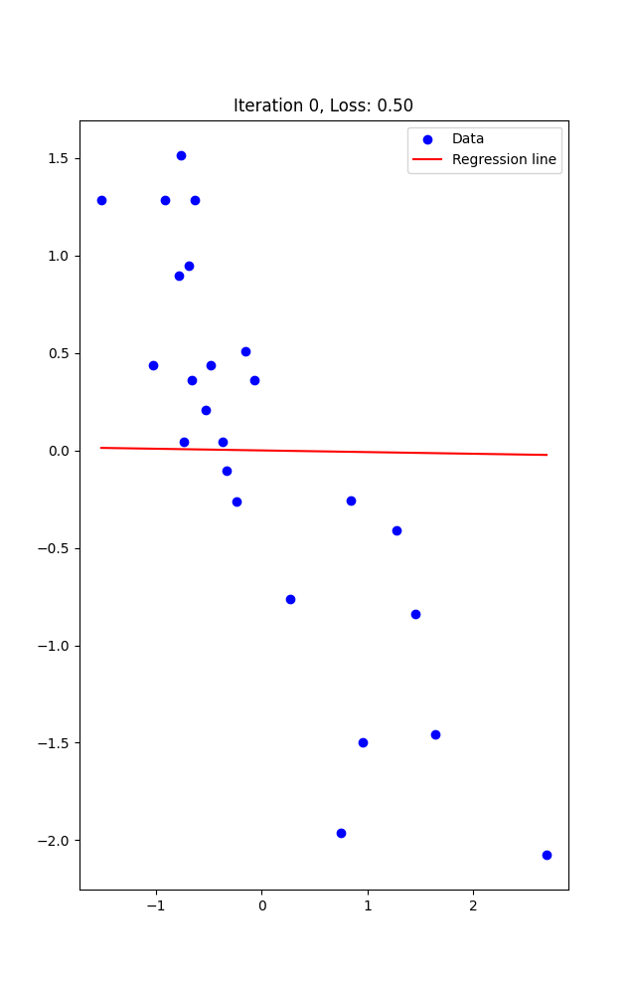

# Linear Regression Car Price Estimation

This repository contains a simple implementation of linear regression to predict car prices based on mileage.



## Installation

First, make sure you have Python installed on your system. Then, install the required dependencies using pip:

```bash
pip install -r requirements.txt

``` 

# Usage

## Train the model

To train the linear regression model and save the theta parameters, run:

``` sh
python trainer.py
```

## Verbose Mode (Animated Scatter Plot)

You can use the --verbose flag to enable a visual animated scatter plot that shows the internal workings of the model during training:

``` sh
python trainer.py --verbose
```

## Price Prediction

After training the model and saving the theta parameters, you can use the predict.py script to predict a car price based on mileage:

``` sh
python predict.py
```

# License

This project is licensed under the MIT License.
